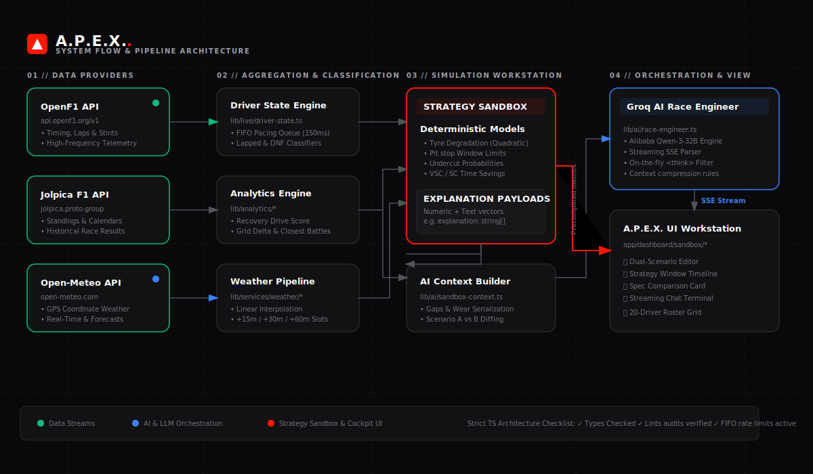

# A.P.E.X. — AI-Powered Formula 1 Race Intelligence

[](#tech-stack)
[](#brand-identity)
[](#design-system)
[](#development-roadmap)

A.P.E.X. (AI-Powered Race Intelligence) is a Formula 1 Mission Control platform that combines live telemetry, weather intelligence, deterministic strategy simulation, and an AI Race Engineer to recreate the decision-making environment of a modern Formula 1 pit wall.

---

## 🖥️ Live Demo

**Coming Soon**

The application is being prepared for public deployment. Once live, it can be accessed at:
[https://apex-raceiq.vercel.app](https://apex-raceiq.vercel.app)

---

## 📐 System Architecture

The following diagram illustrates the flow of real-time data from APIs, through processing and simulation layers, and into the AI Race Engineer and Cockpit UI:



For a detailed breakdown of rate-limiting pacing, data models, and the context compiler, read the [System Flow Documentation](docs/system-flow.md).

---

## 🏎️ Why A.P.E.X.?

Most Formula 1 applications provide data. **A.P.E.X. provides decision support.**

The platform combines live telemetry, weather intelligence, strategy simulation, and AI-powered race engineering to recreate the high-pressure experience of a Formula 1 pit wall workstation. Rather than just viewing timing sheets, you are equipped with the models and intelligence necessary to evaluate undercut margins, track weather transitions, and make race-critical strategy calls.

---

## ⚡ What Makes A.P.E.X. Different?

* **✓ Deterministic Strategy Simulations**: Simulates pace curves, undercut success, and safety car windows using mathematical models first, rather than relying on generative AI hallucinated stats.
* **✓ Real-Time OpenF1 Telemetry**: Pulls live timing streams directly from F1 timing feeds.
* **✓ Weather-Aware Race Intelligence**: Integrates Open-Meteo forecasts and interpolates weather metrics into high-resolution strategic time slots.
* **✓ AI Race Engineer Powered by Groq**: Runs conversational strategy dialogue streaming with Alibaba's Qwen 32B model, stripping out reasoning thoughts on-the-fly.
* **✓ Side-by-Side Strategy Comparisons**: Allows editing and contrasting two distinct paths (Scenario A vs. Scenario B) to isolate pace advantages.
* **✓ Driver State Aggregation Engine**: Merges multiple timing and tyre streams into unified driver telemetry maps.
* **✓ Race Control Integration**: Parses track flag status and lists live scrolling logs of race control notifications.
* **✓ Live Tyre and Pit-Stop Tracking**: Monitors compound choices, stint ages, and pit stop durations.

---

## ⚙️ Engineering Highlights

Recruiters and developers reviewing this codebase will find deep technical implementations of real-time software systems:
* **Real-time OpenF1 Telemetry Aggregation**: Combines multi-stream timing data into state maps in real-time.
* **FIFO Request Queue for API Rate Limiting**: Built a Promise Queue wrapper that enforces a strict `150ms` delay between OpenF1 requests, preventing 429 errors.
* **Adaptive Polling Architecture**: Polls every 3s during active live sessions, 60s for upcoming races, and disables polling completely for historical completed races to save resources.
* **Driver State Aggregation Engine**: Decoupled domain models that sorttiming boards, calculate lapped offsets, and handle retired/DNF classifications.
* **Weather Intelligence Pipeline**: Interpolates hourly data points into forecast increments (+15m, +30m, +60m) to map tyres wet-dry crossover boundaries.
* **Deterministic Simulation Engine**: Implements non-linear tyre wear cliffs (quadratic decay curves) and undercut probability curves.
* **AI Context Compression System**: Serializes timing gaps, standings, and model explanation payloads into compact, token-optimized LLM system prompts.
* **Streaming LLM Responses with Groq**: Decodes Server-Sent Events (SSE) from Groq on-the-fly and filters out reasoning `<think>` tags before UI rendering.
* **Strict TypeScript Architecture**: Written under strict compile checks with `0` type errors and `0` ESLint warnings.

---

## 🗺️ Development Roadmap

✅ **Phase 1** — Landing Experience

✅ **Phase 2** — Calendar & Standings

✅ **Phase 3** — Race Weekend Hub

✅ **Phase 4** — Analytics Engine

✅ **Phase 5** — Live Timing Center

✅ **Phase 6** — AI Race Engineer

✅ **Phase 6.5** — Weather Intelligence

✅ **Phase 7** — Strategy Sandbox

🚧 **Phase 8** — Race Story Mode

📅 **Phase 9** — Predictive Analytics

📅 **Phase 10** — Personal Race Engineer

---

## 🔌 Data Sources

A.P.E.X. relies on a collection of open-source and high-performance APIs:
* **OpenF1**: Real-time timing, tyre compounds, stints, and vehicle telemetry.
* **Jolpica F1 API**: Historical race statistics, rounds calendar, and championship standings.
* **Open-Meteo**: GPS-based circuit weather and moisture forecasts.
* **Groq Cloud**: Real-time strategy dialogue stream running Qwen 32B.

---

## 🛠️ Tech Stack

* **Framework**: [Next.js 15](https://nextjs.org/) (App Router, Node.js runtime)
* **Language**: [TypeScript](https://www.typescriptlang.org/)
* **Styling**: [Tailwind CSS](https://tailwindcss.com/)
* **State & Data**: [TanStack React Query v5](https://tanstack.com/query/latest)
* **Charts**: [Recharts](https://recharts.org/)
* **Icons**: [Lucide React](https://lucide.dev/)

---

## 🚀 Installation & Local Development

Follow these steps to run A.P.E.X. locally:

1. **Clone the repository:**
   ```bash
   git clone https://github.com/ShubhamKumar1703/A.P.E.X-.git
   cd A.P.E.X-
   ```

2. **Configure Environment Variables:**
   Create a `.env` file in the root directory:
   ```env
   GROQ_API_KEY=your_groq_api_key_here
   ```

3. **Install dependencies:**
   ```bash
   npm install --legacy-peer-deps
   ```

4. **Start the development server:**
   ```bash
   npm run dev
   ```

5. **Access the workstation:**
   Open [http://localhost:3000](http://localhost:3000) in your browser.

---

## 📄 License

This project is licensed under the MIT License.
