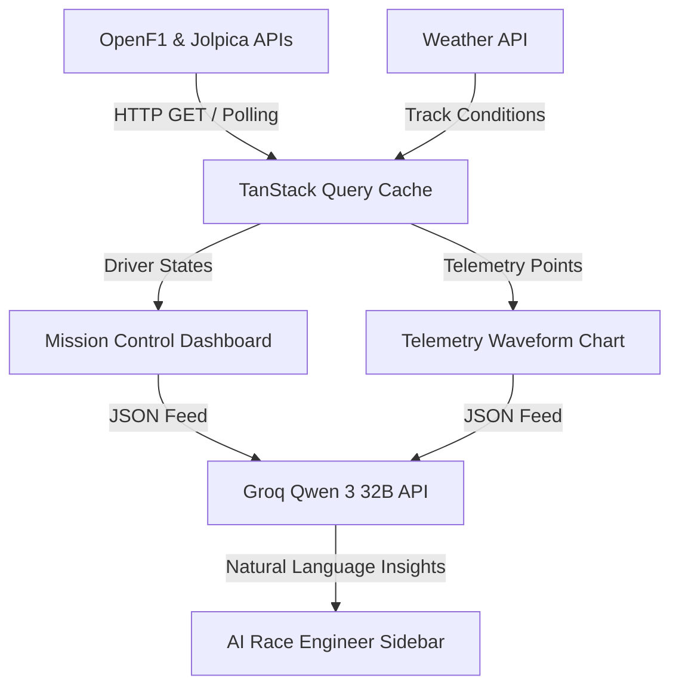

# A.P.E.X. — System Architecture & Design

Welcome to the internal engineering documentation for **A.P.E.X.**, the AI-Powered Formula 1 Mission Control Platform. This document provides a high-level overview of the architectural design, folder structure, data flows, and planned integrations.

---

## 1. Project Overview
A.P.E.X. functions as a digital race engineering dashboard designed to feel like an internal F1 strategy workstation. The design style combines premium dark-themed SaaS aesthetics (inspired by Linear, Vercel, and Bloomberg Terminal) with motorsport telemetry layouts.

- **Primary Accent**: `#FF1801` (Racing Red)
- **Base Surfaces**: Zinc-950, Zinc-900, Zinc-800
- **Typography**: Clean, tech-focused typography emphasizing monospaced timing indicators.

---

## 2. Directory Structure
The workspace is structured logically to separate presentational logic, shared state hooks, layouts, and type specifications:

```text
C:\Program Files\BlackMatter\APEX\
├── app/                  # Next.js App Router (pages and shell)
│   ├── layout.tsx        # Global shell and font provider
│   ├── page.tsx          # Phase 1 Landing Page
│   └── globals.css       # Global styling configurations
├── components/           # Reusable UI Components
│   ├── layout/           # Sidebar, Navbar, Mobile navigation stubs
│   ├── landing/          # Hero, Features grid, CTAs, Footer
│   ├── dashboard/        # Live Timing, Pit Stop, Strategy stubs
│   └── race/             # Race, Driver, and Constructor cards stubs
├── hooks/                # Custom hooks (data polling, active drivers)
├── lib/                  # Utilities (design system, formatting)
├── types/                # Strict TypeScript typings
├── data/                 # Static mock data (e.g. 2026 Season Schedule)
├── docs/                 # Engineering architecture & roadmap specifications
└── public/               # Static images and vectors
```

---

## 3. Planned Architecture
The application runs as a Next.js App Router application written in TypeScript. Styling is driven by Tailwind CSS configured with a bespoke design system token library (`lib/design-system.ts`).

- **State Management**: React Context/State for UI state; TanStack Query (`@tanstack/react-query`) for API fetching, caching, and polling operations.
- **Visualizations**: Responsive charts implemented with `Recharts` to draw live throttle, brake, speed, and telemetry lines.
- **Animations**: `framer-motion` for micro-interactions, layout transitions, and telemetry data refreshes.

---

## 4. Future API Integrations
A.P.E.X. is designed to ingest data from multiple motorsport and external data sources in later phases:

### OpenF1 API (Live Telemetry & Timing)
- **Endpoint**: `https://api.openf1.org/v1`
- **Use Case**: Real-time telemetry (speed, RPM, gear, throttle/brake applications, DRS status), tyre compounds, and live timing lap offsets.
- **Data Refresh Model**: 1Hz poll rate or WebSocket streaming where applicable.

### Jolpica API (Historical Data)
- **Endpoint**: `https://api.jolpica.org` (replaces Ergast)
- **Use Case**: Historical qualifying results, race standings, constructor records, and driver histories.

### Weather API (Track Weather Conditions)
- **Endpoint**: OpenWeather or specialized race circuit tracking feeds.
- **Use Case**: Live track temperature, air temperature, wind velocity, humidity, and rainfall probability to feed strategy predictions.

### Groq API / Qwen 3 32B (AI Race Engineer)
- **Endpoint**: Groq Cloud API
- **Use Case**: Processes live race timing data and weather forecasts to generate real-time pit window recommendations, race preview summaries, and contextual commentary.

---

## 5. Data Flow Overview
The data pipeline runs through TanStack Query down to individual presentational widgets:


